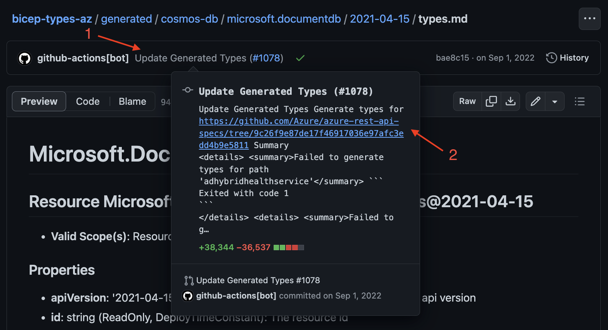

# Troubleshooting
Please use this guide to help understand and troubleshoot errors with Bicep's Azure type definitions.

## Background
Bicep type definitions are automatically generated on a regular cadence, using Azure REST API spec definitions from the [azure-rest-api-specs](https://github.com/Azure/azure-rest-api-specs) repository.

Type definitions are statically included with each release of Bicep, meaning that each Bicep release has a point-in-time view of this repository. As such, the first step of troubleshooting any Bicep Types issue is **always** to ensure you are testing with the latest release of Bicep, to ensure you're not looking at a problem which has already been fixed. Bicep's release cadence is usually once a month, meaning the latest release of Bicep may lag at most 1 month behind what is currently in the main branch in the API specs repo.

You can view the most recent set of generated Bicep type definitions using [`generated/index.md`](../generated/index.md).

## Is this a duplicate issue?
Please ensure you have searched [issue reports](https://github.com/Azure/bicep-types-az/issues) to ensure that you're not reporting an issue which has been previously reported. If you find an existing issue has already been raised, please consider adding a GitHub Reaction to help us prioritize the fix.

## Is this an API spec issue, or a runtime behavior issue?
* If this is a problem with type definitions in Bicep not accurately representing data accepted or returned by the service, this is most likely an API spec issue. In this case, please follow the steps under [API Spec (Swagger) Inaccuracies](#api-spec-swagger-inaccuracies) to the best of your abilities. Examples include:
    * Missing type definitions
    * Missing, incorrectly named properties
    * Bad documentation
* If this is a problem with the service misbehaving, please raise an issue in this repo after having searched for duplicates. Examples include:
    * Valid bicep that fails when deployed.
    * Suspected race conditions.
    * Service errors that are unactionable or don't contain enough information to understand the problem.

## Finding a type definition
1. Open [`generated/index.md`](../generated/index.md).
    > **NOTE** This file may be too large for GitHub to render, so you may need to select "View raw" to see the contents.
1. Search for the name of the resource type you're having problems with, and use the link to navigate to the `types.md` file containing a readable representation of the types. The folder structure will usually be of format `generated/{spec_dir}/{provider_name}/{api_version}/types.md`.
    > **EXAMPLE** Locating type definitions for `Microsoft.DocumentDB/databaseAccounts@2021-04-15`:
    > 1. Search `index.md` for "Microsoft.DocumentDB/databaseAccounts".
    > 1. Under the results, find the link for the API version you're having problems with (e.g. [`cosmos-db/microsoft.documentdb/2021-04-15/types.md#resource-microsoftdocumentdbdatabaseaccounts2021-04-15`](../generated/cosmos-db/microsoft.documentdb/2021-04-15/types.md#resource-microsoftdocumentdbdatabaseaccounts2021-04-15)).
    > 1. Click this link and you should see a markdown file containing a readable representation of Bicep's understanding of a given type.
1. If you're unable to find a type definition, it's possible that the API spec has not yet been published.

## API Spec (Swagger) Inaccuracies
Many of the "issue type" categories are most commonly the result of service owners publishing an API definition which does not exactly match the behavior of the real-life service. Generally, when understanding these types of issues, there are 3 possibilities:
1. The API spec does not accurately match the behavior of the service (API spec bug).
1. There **was** an API spec bug which has since been fixed, but not yet picked up by Bicep's type generation.
1. There is a bug in Bicep's type generation logic such that a **valid** API spec is not being understood correctly by Bicep.

Usually, (1) is the most likely option, although (2) is also common in cases where a recent API version has **just** been published and not yet picked up by Bicep.

### Locating the API Spec
1. Use the steps described in [Finding a type definition](#finding-a-type-definition) to locate the `types.md` file containing the problematic type. If dealing with a missing type, this may not be possible; instead follow the folder structure from [`generated`](../generated) or use search to locate the folder for other API versions published by the same provider.
1. Use GitHub's UI to identify when this file was last modified, and the link to the API Specs repo which was used to generate the file.
    > **EXAMPLE** In the following screenshot of the view for the file/folder found in the previous step:
    > * Hover over the latest change made to this file/folder (see arrow marked 1).
    > * Click on or copy the link in the commit description popup (see arrow marked 2).
    > 
1. Navigate to the equivalent folder structure in the API Specs repo, using the link from the previous step. You may need to use GitHub's UI to help here. For a file under `generated/{spec_dir}/{provider_name}/{api_version}`, the equivalent folder structure will usually be of format: `specification/{spec_dir}/resource-manager/{provider_name}/{preview|stable}/{api_version}`. This should give you a link to this folder at the same point in time as Bicep's types were last generated.
    > **EXAMPLE** For `cosmos-db/microsoft.documentdb/2021-04-15/types.md`, the equivalent path in the API Specs repo will be `specification/cosmos-db/resource-manager/Microsoft.DocumentDB/stable/2021-04-15`.
    > This should give you the [following link](https://github.com/Azure/azure-rest-api-specs/tree/9c26f9e87de17f46917036e97afc3edd4b9e5811/specification/cosmos-db/resource-manager/Microsoft.DocumentDB/stable/2021-04-15).

### Identifying the problem
There's no cut-and-dry approach to locating a problem with an API definition. Understanding the basics of the [Swagger V2](https://swagger.io/specification/v2/) specification will help you here.

Because it's a very large repo, it may be worth scoping down your search criteria as much as possible by adding unique keywords (e.g. unique property names), or path filters.

The questions to try and answer:
* Do you see the same problem in Swagger as you see in Bicep types?
    * Has the problem already been fixed?
        > Look at the diff between the Swagger file on the `main` branch and the commit you found from the Bicep types repo. If the problem is no longer present and has been fixed in the last month, it should be automatically resolved with the next Bicep relase.
    * Has the problem already been reported?
        > 1. Search the API specs repo for [existing issue reports](https://github.com/Azure/azure-rest-api-specs/issues) to see if there's already an issue raised.
        > 1. You're welcome to raise an issue in this repo in addition, to help prioritize the fix and make it discoverable for other Bicep users. Please ensure you link it to the API specs issue you found.
    * If the answer to the previous two questions is "no", please [raise an issue](https://github.com/Azure/azure-rest-api-specs/issues) in the API specs repo. You're welcome to raise an issue in this repo in addition, to help prioritize the fix and make it discoverable for other Bicep users. Please ensure you link it to the API specs issue you created.
* If the answer to the preview question is "no", please go ahead and raise an issue in this repo.

## Documentation
The [ARM Template Reference](https://learn.microsoft.com/en-us/azure/templates/) documentation is automatically generated from this repository. This may also be updated on a different cadnece to Bicep, meaning there's the potential for the information in this documentation to be out of sync with the latest Bicep release.